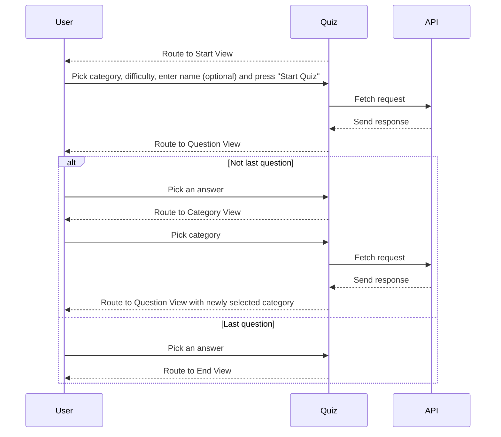

```mermaid
sequenceDiagram
participant User
participant Quiz
participant API

      Quiz-->>User: Route to Start View
      User->>Quiz: Pick category, difficulty, enter name (optional) and press "Start Quiz"
      Quiz->>API: Fetch request
      API-->>Quiz: Send response
      Quiz-->>User: Route to Question View

    alt Not last question
      User->>Quiz: Pick an answer
      Quiz-->>User: Route to Category View
      User->>Quiz: Pick category
      Quiz->>API: Fetch request
      API-->>Quiz: Send response
      Quiz-->>User: Route to Question View with newly selected category

    else Last question
      User->>Quiz: Pick an answer
      Quiz-->>User: Route to End View

end
```
